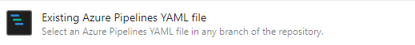
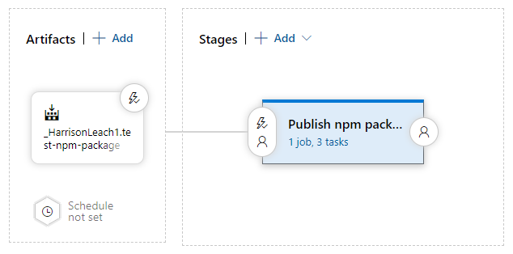

# azure-devops-for-npm-example

How to use Azure DevOps for CI/CD of a simple npm React component library or React app bootstrapeed with CRA.

## Prerequisites

-   Repository bootstrapped with CRA (should use jest for unit tests)

## Add build, unit test and code coverage checks for PRs

1. Install the [Azure Pipelines Application](https://github.com/marketplace/azure-pipelines) and enable it for your repository.
2. Ensure `jest-junit` is installed. If not, run `npm i jest-junit`.
3. Create a new `test-pipeline.yml` for your repository and use the steps from this [`test-pipeline.yml`](./test-pipeline.yml).
4. From Azure DevOps > Pipelines, create a new pipeline for your repository. Under 'Configure' select the following option:
   

Select your `test-pipeline.yml` file for the path and complete the review.

## Create an npm release on tag creation

1. Create a new `build-pipeline.yml` for your repository and use the steps from this [`build-pipeline.yml`](./build-pipeline.yml).
2. Create another pipeline in Azure DevOps using `build-pipeline.yml`. This pipeline creates an artifact build which is the tgz to be released to npm.
3. From Azure DevOps > Releases, create a new release pipeline and select 'Empty Job'. Under 'Artifacts', Add the artifact from the build pipeline. Note that the continuous deployment trigger should be enabled to create a new release on every artifact build.
   
4. Under 'Stages', select the first stage and add tasks to create a new folder and extract the `.tgz` file into that folder.
5. Create an npm task to publish the contents of the folder. Note that you will need a service connection here to npm, this can be created by pressing 'New', under the Registry URL use `https://registry.npmjs.org` and the auth token can be generated from your npm account.
